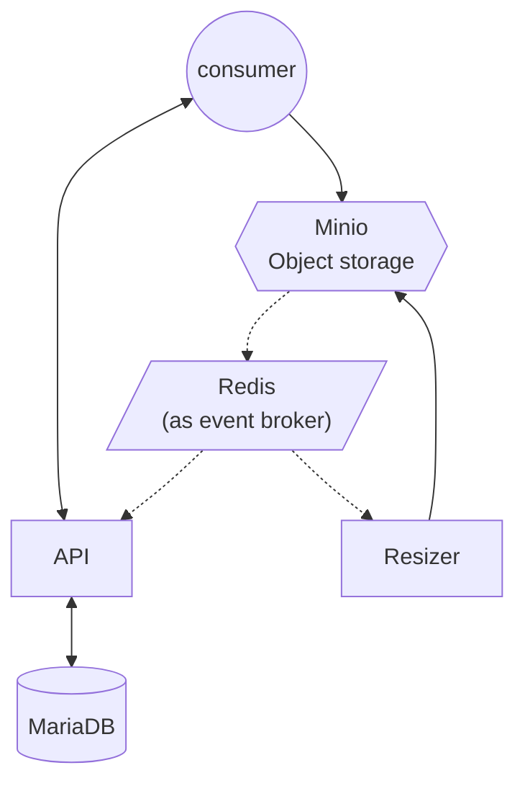

# Async infra PoC for image resize

> **WARNING**: This project is for educational purposes only, don't try to apply this
> in production.

## WTF is it? 📌

This is a PoC _(Proof of Concept)_ to learn about async infra implementations; in this case it's an
API to upload images and get them in different sizes.



## Getting Started 🚀

### Requirements 📋

* Node.js (>= 18.x.x)
* npm (>= 9.x.x)
* docker-compose

### Project setup 🔧

Install Node.js dependencies

```bash
$ npm install
```

Start Docker Compose project

```bash
$ docker compose up --build
```

### Test It ⚙️

Use `client.sh` for testing:

#### List images

```bash
$ ./client.sh list
```

#### Get image data

```bash
$ ./client.sh get <id>
```

#### Upload a new image

```bash
$ ./client.sh upload <name> <file>
```

## Project 📦

The project is developed with the [NestJS](https://nestjs.com/) framework using its
[monorepo mode](https://docs.nestjs.com/cli/monorepo), with a default app called
`poc-async-img-resize`, used here as the API service.

### Project structure

```
├── apps                    // Applications (services) 
├── libs                    // Shared libraries
├── compose                 // Files for Docker Compose (config, entrypoints, etc.)
├── docker-compose.yaml     // Docker compose file
└── client.sh               // Simple client for test the API (in bash scripting)
```

### Apps

The apps are basically services here. There are two, and they are in the `apps` directory.

#### poc-async-img-resize

This is the main app and has a RESTful API to upload and retrieve image info. In this PoC
it handles only the name and the state of _sizes_.

#### resizer

Microservice to resize images. This service doesn't listen on any port; it only
subscribes to a broker queue and processes images to resize.

### Libs

In this directory there are shared libraries for the apps:

#### config-tree

This lib is used only to load configuration from environment variables using an object
structure.

#### config-validate

For config validation using `class-validator`.

#### minio

An abstraction for the MinIO client, implemented as a Nest module.

#### minio-events-serializer

A simple deserializer to transform MinIO events to the standard Nest events pattern.

#### redis-events

For some reason, I didn't find a good Redis event emitter for NestJS, so I implemented
it as a Nest module, listening to a Redis list and emitting events using the Nest EventEmitter.

#### sizes

A simple shared lib to define the sizes used in the project, reading from environment
variables.

### Compose

Compose directory contains files for docker-compose setup, like configs, etc.

```
compose
├── config      // Config envs for services
├── mc          // Minio config, policies and buckets setup
└── node        // Nodejs related files (like Dockerfile)
```

### client.sh

This script is a simple client for testing the API; it uses `curl` for requests and `jq`
to format the output.

## License 📄

WTFPLv2 - DO WHAT THE FUCK YOU WANT TO PUBLIC LICENSE
